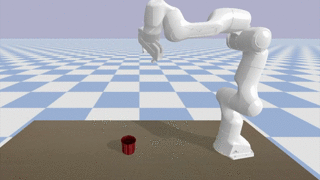
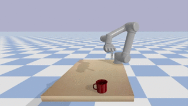

# Quality Diversity for Grasping in Robotics (QD-Grasp)

**Status:** *refactoring in progress*




## About
This code allows the generation of repertoires of diverse and high-performing grasping trajectories with Quality-Diversity methods.

Visit the **project webpage** for more details: [https://qdgrasp.github.io/](https://qdgrasp.github.io/)
### Supported platforms

* Kuka iiwa + 2-fingers gripper (*kuka_wsg50*)
* Kuka iiwa + Allegro hand (*kuka_allegro*) 
* Baxter + 2-fingers gripper (*baxter_2f*)
* Franka Emika Panda + 2-fingers gripper (*panda_2f*)
* UR5 + SIH Schunk hand (*ur5_sih_schunk*)

Interested in applying QD methods to your robot? Please consider opening an issue or making a pull request to extend the set of supported platforms.

### Associated Papers

* *Quality Diversity under Sparse Reward and Sparse Interaction: Application to Grasping in Robotics*, Huber, J., Hélénon, F., Coninx, M., Ben Amar, F., Doncieux, S. (2023) ([draft version](https://arxiv.org/abs/2308.05483))
* *Domain Randomization for Sim2real Transfer of Automatically Generated Grasping Datasets*, Huber, J., Hélénon, F., Watrelot, H., Ben Amar, F., Doncieux, S. (2023) ([draft version](https://arxiv.org/abs/2310.04517))
* *Learning to grasp: from somwhere to anywhere*, Hélénon, F., Huber, J., Ben Amar, F., Doncieux, S. (2023) ([draft version](https://arxiv.org/abs/2310.04349))


## Before starting

### Recommandations

* use python 3.8.x or 3.9.x: versions >3.10.x cause problems with scoop
* scoop parallelization requires multiple cpu cores; lower number of threads => slower exploration

## Install

```
python3 -m venv qdg
source qdg/bin/activate
```
```
pip3 install -r requirements.txt
pip3 install -e gym_envs
pip3 install -e .
```

## Examples

### Trajectory generation

Debug mode, to visualize each evaluation: 
```
python3 run_qd_grasp.py -a me_scs -r kuka_wsg50 -o ycb_power_drill -nbr 2000 -d
```

Longer run with scoop parallelization:
```
python3 -m scoop run_qd_grasp.py -a me_scs -r kuka_wsg50 -o ycb_power_drill -nbr 25000
```


### Visualizing output

To replay successful trajectories from a completed run:
```
python3 visualization/replay_trajectories.py -r path_to_run_folder/
```
Visualise the approach trajectories:
```
python3 visualization/plot_trajectories.py -r path_to_run_folder/
```
Visualise the success archive as fitness heatmap:
```
python3 visualization/plot_success_archive_heatmap.py -r path_to_run_folder/
```

### Domain-Randomization-based quality criteria 
To compute the DR-based fitnesses for each generated success:
```
python3 data_analysis/dr_quality_criteria/compute_dr_criteria.py -r path_to_run_folder/
```


## Ressources: 

### Quality diversity
Contrary to standard single-objective methods, QD algorithms aims to optimize to generate a set of diverse and high-performing solutions to a given problem. Tutorials and papers:
https://quality-diversity.github.io/

### Supported methods
Best performing QD algorithms on grasping:
- **ME-scs**: A MAP-Elites variant that selects the successful individuals from the archive in priority.
- **ME-fit**: A MAP-Elites variant that selects the best-performing individuals from the archive in priority. 
- **ME-nov-fit**: A MAP-Elites variant that leverage pareto-front-based selection on novelty and fitness to sample individuals from the archive.
- **ME-nov-scs**: A MAP-Elites variant that selects the most novel individuals among the successful ones in priority.

Other supported variants:

- **Random**: Population-based method that randomly select individuals at each generation.
- **Fit**: Population-based method that select the best-performing individuals in priority at each generation.
- **NS**: *Lehman, J., & Stanley, K. O. (2011). Abandoning objectives: Evolution through the search for novelty alone. Evolutionary computation, 19(2), 189-223.* ([paper](https://stars.library.ucf.edu/cgi/viewcontent.cgi?article=2529&context=facultybib2010))
- **ME-rand**: *Mouret, J. B., & Clune, J. (2015). Illuminating search spaces by mapping elites. arXiv preprint arXiv:1504.04909.* ([paper](https://arxiv.org/pdf/1504.04909.pdf))
- **ME-nov**: A MAP-Elites variant that selects the most novel individuals from the archive in priority. 
- **NSLC**: *Lehman, J., & Stanley, K. O. (2011, July). Evolving a diversity of virtual creatures through novelty search and local competition. In Proceedings of the 13th annual conference on Genetic and evolutionary computation (pp. 211-218).* ([paper](https://dl.acm.org/doi/pdf/10.1145/2001576.2001606))
- **NSMBS**: *Morel, A., Kunimoto, Y., Coninx, A., & Doncieux, S. (2022, May). Automatic acquisition of a repertoire of diverse grasping trajectories through behavior shaping and novelty search. In 2022 International Conference on Robotics and Automation (ICRA) (pp. 755-761). IEEE.* ([paper](https://ieeexplore.ieee.org/iel7/9811522/9811357/09811837.pdf?casa_token=JuAiNwQBeTAAAAAA:t7w_wa5whW-gbNcN3rYHNZ6Lvy7J7F_98EhH1uZxPaJRjZ0eLy37wOQBn_YJYRUQdf7uwtx49aI))
- **SERENE**: *Paolo, G., Coninx, A., Doncieux, S., & Laflaquière, A. (2021, June). Sparse reward exploration via novelty search and emitters. In Proceedings of the Genetic and Evolutionary Computation Conference (pp. 154-162).* ([paper](https://dl.acm.org/doi/pdf/10.1145/3449639.3459314))
- **CMA-ES**: *Hansen, N. (2016). The CMA evolution strategy: A tutorial. arXiv preprint arXiv:1604.00772.* ([paper](https://arxiv.org/pdf/1604.00772.pdf))
- **CMA-ME**: *Fontaine, M. C., Togelius, J., Nikolaidis, S., & Hoover, A. K. (2020, June). Covariance matrix adaptation for the rapid illumination of behavior space. In Proceedings of the 2020 genetic and evolutionary computation conference (pp. 94-102).* ([paper](https://dl.acm.org/doi/pdf/10.1145/3377930.3390232))
- **CMA-MAE**: *Fontaine, M., & Nikolaidis, S. (2023, July). Covariance matrix adaptation map-annealing. In Proceedings of the Genetic and Evolutionary Computation Conference (pp. 456-465).* ([paper](https://dl.acm.org/doi/pdf/10.1145/3583131.3590389))


## TODO :
* fix nslc args issue


